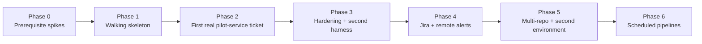

# Ark phased build plan

Status: draft. Each phase ends in a demonstrable, verifiable state. No factory evals (decision 42); each phase has acceptance criteria proven by running the real thing.

## Phase 0: Prerequisite spikes (throwaway, findings recorded)

Goal: prove or refute the assumptions the design depends on. No ark code. Run directly on the engineer's machine (decision 44: no sandbox in Phases 0–1). Each spike follows pstack's Prototype playbook: one decision, the smallest script that exercises it, the observation is the result, the script is thrown away.

| Spike | Decision it settles | Done when |
|---|---|---|
| S1 Headless harness launch | Can ark drive Claude Code and OMP as role attempts? | Each runs a prompt non-interactively in a given workdir, writes a JSON output file, emits a parseable event stream with usage (or reports none), and dies cleanly on SIGTERM with no surviving children |
| S2 Model route | Which provider route do roles use? | Approved route named in writing (enterprise route for the pilot environment's code); one call through each harness on that route succeeds |
| S3 Clean environment | Can a trusted runner stand up the product reproducibly? | `docker compose -p ark-<run>` up/seed/health/down from a clean worktree succeeds twice in a row without touching the engineer's dev stack; fixed `container_name` handled or single-slot accepted; private package secrets read from the runner's env only |
| S4 Pilot ticket fit | Is the pilot ticket a valid first pilot? | On the pre-change revision, an acceptance check (register a record referencing a missing object in storage → expect rejection) fails for that reason; on the fixed revision, it passes; both against a cloud emulator |
| S5 Dogfood pstack | Which pstack pieces does ark adopt as-is vs rewrite? | Notes from using pstack (Prototype, how, architect) during S1–S4 and Phase 1 planning: what worked unchanged, what assumed self-orchestration |

Exit: written findings in `docs/research/phase0-<spike>.md`. Any failed spike changes the plan before Phase 1.

Status (2026-10-08): S1 pass, S2 settled (current Anthropic account approved), S3 pass, S4 pass, S5 running log. Phase 1 changes from the findings: adapters pin config (`--model`, no inherited MCP/extensions) and judge completion by exit plus output file; the verification runner owns run-scoped image tags, forces builds, and records the full revision vector; `ark-acceptance` requires a positive control for rejection-style checks; the pilot's env tasks switch the service to stub auth and disclose it.

## Phase 1: Walking skeleton (one repo, one ticket, end to end)

Smallest slice that touches every seam once. Architecture and the 10-unit build order: [phase1/RATIONALE.md](phase1/RATIONALE.md), [phase1/MODULES.md](phase1/MODULES.md), typed sketch in `phase1/sketch/` (event-sourced pure `decide` + idempotent effect handlers, chosen by pstack architect/arena).

- Repo setup: TypeScript/Node, `schemas/` for ticket, plan, acceptance, build, review, verification, qe_report, defect, event, manifest.
- Service + SQLite ledger + projections; CLI: `ark env add`, `ark ticket new` (local), `ark run`, `ark gate decide`, `ark verify`, `ark emit`, `ark status`.
- `pipeline.yaml` loader + state machine with the default pipeline, shared repair cap, deadlines, invalid-output retries.
- Claude Code adapter running unsandboxed; post-attempt tamper detection (locked-check hashes, allowed-path diff check). Box backend deferred (decision 44).
- Verification runner using the environment's tasks; evidence bundle with SHA256SUMS and redaction.
- First skills: `ark-intake`, `ark-how`, `ark-architect`, `ark-acceptance`, `ark-build`, `ark-review`, `ark-review-lead`, `ark-qe`, `ark-test-audit` (author/review/defect modes).
- Minimal dashboard: board, needs-human queue with plan approval, ticket view (rendered plan/acceptance), evidence viewer (logs + HAR).
- Publish: push branch, open GitLab MR with evidence links; `wait` on CI and merge status.
- Environment config in `<product>-agentic-environment/ark/` (pipeline, roles, tasks, risk rules moved from `factory/`).

Acceptance criteria (each demonstrated live, not by unit test):

1. Re-run of the pilot ticket's change as a local ticket against the pre-change commit reaches an MR with a green evidence bundle.
2. Builder attempt to edit a locked check is blocked by the sandbox, and the attempt fails validation.
3. A deliberately wrong build produces a QE defect with a working repro command and returns to Build; after 3 failures the ticket goes to needs-human.
4. Killing the service mid-build and restarting reattaches or resumes without a second writer.
5. Dashboard shows stage, model, harness, elapsed time, cost (or "unknown"), repair count, and same-model disclosure.

## Phase 2: First real pilot-service ticket

- Pick an open pilot-service ticket (not historical). Run it through ark with the engineer at the gates.
- Risk classification on intake and on the real diff; QMS gate wired with a traceability add-on skill from the environment (only if the ticket is high-risk or a high-risk dry run is done).
- Takeover / hand-back in dashboard and CLI.
- Regression proof (fail-before/pass-after) automated for defect fixes.
- Evidence retention policy set with the project; bundle upload to retained GitLab storage.

Exit: one real MR merged by an engineer, with evidence that a reviewer other than the operator could follow.

## Phase 3: Hardening and second harness

- OMP adapter (if Phase 0 spike passed), adapter conformance check run for both.
- Configurable reviewer panel (N reviewers, mixed models) and engineer profile resolution within policy.
- Concurrent tickets with verification queue; Playwright trace viewer; file-watcher live diffs.
- Replay of any stage from recorded inputs (`ark replay <attempt>`).
- Retire the pilot's `factory-*` pointer skills and duplicated env pipeline skills.

## Phase 4: Jira and remote alerts

- Jira REST intake (decide polling vs manual pull, write-back of MR/evidence links, mid-run source edit handling).
- Slack or chosen channel for needs-human alerts; decide remote dashboard access.

## Phase 5: Multi-repo and a second environment

- Dependency edges and binding tasks; revision vectors in verification; MR landing order; post-landing readiness recompute.
- Onboard a second environment: release-branch targeting, submodule binding, its own risk rules (auto-approval paths), its local stack tasks.
- Copier template update so new engineer-agent environments get an `ark/` folder.

## Phase 6: Scheduled pipelines

- `ark-test-audit` audit mode: one coherent MR per run, evidence records in dashboard.
- `ark-reflect` over completed runs; proposals as MRs.
- Optional: ephemeral-deploy verification where a project already has the task.

## Deferred (explicit)

Linux sandbox backend; ark-performed merges; Jira status transitions; factory evals (removed, revisit only on request).
