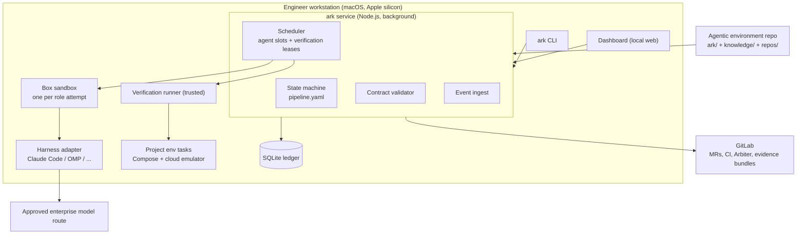
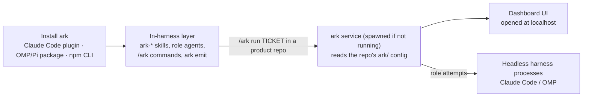
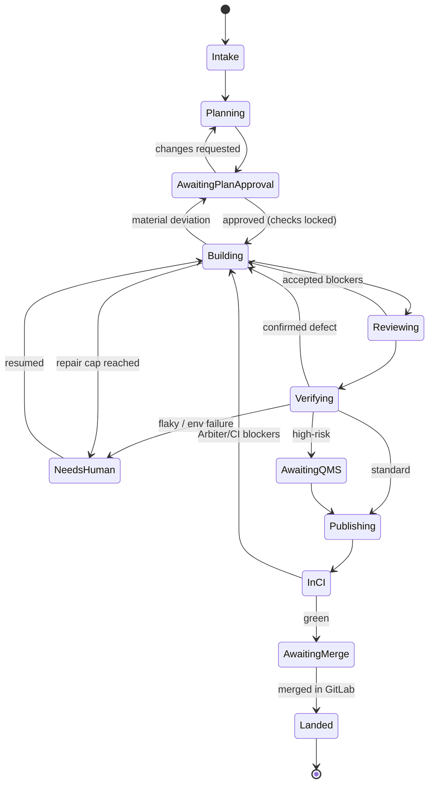

# Ark design spec

Status: draft for review. Source of decisions: [design-interview.md](design-interview.md). Glossary: [CONTEXT.md](../CONTEXT.md). Nothing here has been implemented or exercised.

## 1. Purpose and non-goals

Ark takes one ticket for one product to verified, evidence-backed GitLab merge requests. A deterministic orchestrator runs a declared pipeline. LLM judgment happens only inside role steps.

Non-goals:

- Ark does not merge. Engineers approve and merge in GitLab.
- Ark does not evaluate itself. No golden tickets, seeded-defect campaigns, holdouts, skill evals, profile qualification, or eval dashboard (decision 42).
- Ark is not a QMS record system. Retained GitLab evidence bundles do not establish regulatory compliance on their own.
- Ark contains no product knowledge. Product knowledge stays in each product's agentic environment.
- Arbiter is a separate product. Ark only observes its CI result.

## 2. Architecture



| Module | Owns | Never does |
|---|---|---|
| ark service | Transitions, approvals, scheduling, recovery, ledger writes | Judgment, code edits |
| Contract validator | JSON schema checks on every stage output and policy resolution | Fixing invalid output |
| Sandbox backend (Box) | OS filesystem grants, egress policy, credential placeholders per attempt | Decide stage outcomes; act as audit trail |
| Harness adapter | Launch one role attempt, translate transcript/telemetry to events | Grant permissions, choose next stage |
| Verification runner | Provision fresh env, seed, run locked checks, collect evidence, tear down | Interpret failures (QE does that) |
| Forge adapter (GitLab) | Branch push, MR create/update, evidence upload, CI/approval/merge status | Merge |
| Dashboard | Read projections; submit gate decisions through the service API | Write state directly |
| Agentic environment | Pipeline, roles policy, risk rules, repo graph, env tasks, binding tasks, add-on skills, knowledge | Hold run state |

Reach rule: the service is the only ledger writer. Agents report through `ark emit`, which is an observation, never a transition.

## 3. Layout

### Packaging: a plugin stack that spawns the factory

Ark ships like pstack: one installable stack per harness, all built from one repo. Installing it in a harness gives that harness ark's skills, role agents and slash commands. Those commands start the local ark service and dashboard on demand and drive it. The engine stays harness-agnostic; each harness package is a thin shell over the same core.



| Layer | Ships as | Contains |
|---|---|---|
| Core | npm package `ark` (CLI + service + dashboard assets) | State machine, ledger, adapters, verify runner, forge, dashboard |
| Claude Code plugin | marketplace plugin | `ark-*` skills, role agents, `/ark` commands; depends on the core CLI |
| OMP / Pi package | extension package | Same skills and commands, mapped to OMP tools |
| Other harnesses | adapter + skills folder | Anything that can run a shell command can call `ark` |

Rules: skills and commands never hold flow logic; the service owns it. A harness plugin only needs to run `ark` and load skills. The dashboard is part of the core, so every harness gets the same UI.

### Ark repo

```text
ark/
├── src/                 # service, CLI, adapters, dashboard
├── schemas/             # JSON Schemas for every contract below (versioned)
├── skills/ark-*/        # core skills (SKILL.md + references), see skill-extraction-plan.md
├── roles/               # default role manifests
├── pipelines/default.yaml
├── plugins/
│   ├── claude-code/     # .claude-plugin manifest, agents, commands (skills symlinked from skills/)
│   └── omp/             # OMP/Pi extension package
└── THIRD_PARTY_NOTICES.md
```

### Agentic environment (committed)

```text
<product>-agentic-environment/
├── ark/
│   ├── environment.yaml     # product id, repos, dependency edges, forge, policy
│   ├── pipeline.yaml        # extends or replaces ark default
│   ├── roles/*.yaml         # role overrides within policy
│   ├── risk-rules.jdm.json  # deterministic risk rules (moves from factory/)
│   ├── tasks/               # env up/seed/health/down, binding tasks
│   └── skills/              # add-on skills
├── knowledge/
└── repos/
```

### Generated (gitignored `.ark/`)

```text
.ark/
├── runs/<ticket>/<run-id>/
│   ├── ticket.json  analysis.json  plan.json  acceptance.json   # canonical
│   ├── ticket.md    analysis.md    plan.md                       # rendered views
│   ├── manifest.json
│   ├── attempts/<stage>/<n>/{input.json,output.json,transcript.ref}
│   ├── evidence/<verify-n>/
│   ├── defects/<id>.json
│   └── diffs/<repo>.patch
└── worktrees/<ticket>/<run-id>/<repo>/
```

Per-engineer state: `~/.ark/ledger.sqlite`, `~/.ark/profile.yaml`, short Box state dirs under `~/.ark/box/<attempt>` (Box socket path limit).

## 4. Pipeline definition and state machine

### Stage kinds

| Kind | Executes | Completes when |
|---|---|---|
| `agent` | Role attempt in a sandbox | Output passes its schema and post-conditions |
| `command` | Trusted deterministic command (classify, verify, publish) | Exit status mapped by the stage |
| `gate` | Human decision via CLI/dashboard | Recorded decision on pinned artifact hashes |
| `wait` | External status poll (CI, Arbiter, GitLab approval, merge) | Observed terminal status |

### Default pipeline

```yaml
version: 1
repair_cap: 3              # shared: review blockers + QE defects + Arbiter blockers
stages:
  intake:      { kind: agent,   role: intake,   out: ticket }
  classify:    { kind: command, run: ark.classify-risk, out: risk }
  analyze:     { kind: agent,   role: analyst,  in: [ticket], out: analysis }
  plan:        { kind: agent,   role: planner,  in: [ticket, analysis], out: plan }
  acceptance:  { kind: agent,   role: acceptance-author, in: [plan], out: acceptance }
  plan_gate:   { kind: gate,    approves: [plan, acceptance, risk], locks: acceptance }
  build:       { kind: agent,   role: builder,  in: [plan, acceptance, findings?, defects?], out: build }
  review:      { kind: agent,   role: review-panel, out: review }   # reviewers + lead
  verify:      { kind: command, run: ark.verify, out: verification }
  qe:          { kind: agent,   role: qe, in: [verification], out: qe_report }
  reclassify:  { kind: command, run: ark.classify-risk, on: diff, out: risk }
  qms_gate:    { kind: gate, when: "risk.class == 'high-risk'", approves: [traceability] }
  publish:     { kind: command, run: ark.publish }
  ci:          { kind: wait, for: gitlab.pipeline }                 # includes Arbiter
  landing:     { kind: wait, for: gitlab.merged }
transitions:
  - build -> review
  - review: { pass: verify, blockers: build }
  - verify -> qe
  - qe: { pass: reclassify, defect: build, flaky: needs_human, env_failure: needs_human }
  - reclassify: { same_or_lower: qms_gate?, raised_new_high_risk: plan_gate }
  - publish -> ci
  - ci: { pass: landing, blockers: build, infra_failure: needs_human }
```

Rules the engine enforces regardless of file content:

- Every return to `build` increments the shared repair counter. At the cap, the ticket goes to `needs_human`.
- A new source head invalidates review, verification, and CI results for that head.
- `verify` and `plan_gate` cannot be removed by an environment.
- Invalid agent output gets bounded retries (default 2) with the validation error attached, then `needs_human`.
- Every stage has a deadline. Timeout is a failure class, not a pass.

### Ticket states



`NeedsHuman` and `TakenOver` (manual intervention) can be entered from any active state.

## 5. Stage contracts

All artifacts are JSON validated against `schemas/<name>.v<N>.json`. Markdown is rendered from them. Common envelope:

```json
{ "schema": "plan.v1", "ticket": "PROJ-123", "run": "r_01J...", "attempt": 1,
  "produced_by": { "role": "planner", "manifest_hash": "sha256:..." },
  "inputs": [{ "artifact": "analysis", "hash": "sha256:..." }], "body": { } }
```

| Artifact | Required body fields |
|---|---|
| `ticket` | `source` (`local`\|`jira`), `source_ref`, `source_hash`, `title`, `intent`, `acceptance_hints[]`, `product` |
| `risk` | `class`, `rule_hits[]` (rule id, reason), `rules_hash`, `basis` (`intake`\|`diff`), `raised_by_human?` |
| `analysis` | `repos[]` (id, why), `dependency_edges[]`, `knowledge_refs[]` (path + hash), `risks[]`, `unknowns[]` |
| `plan` | `steps[]`, `repos[]`, `allowed_paths[]` per repo, `out_of_scope[]`, `approach`, `deviation_policy` |
| `acceptance` | `checks[]`: id, repo or `environment`, path(s), helper/fixture paths, command, environment class, `gate_answers{behavior, regression, why_not_covered, test_only_hook}`, limitations (e.g. "auth stubbed locally") |
| `build` | `heads{repo: sha}`, `deviations[]` (minor, with reason), `tests_added[]` with gate answers, `material_change_request?` |
| `review` | `reviewers[]` (model, harness), `findings[]` (id, severity, file, line, rationale, raised_by[]), `lead_disposition[]` (act/consider/noted/dismissed), `blockers[]` |
| `verification` | See §8 |
| `qe_report` | `verdict` (`pass`\|`defect`\|`flaky`\|`env_failure`), `defects[]` (§9), `same_model_as_builder` |
| `traceability` | Produced by env add-on skill; schema owned by environment |

Post-conditions checked by the service, not the agent: diff paths within `allowed_paths`; no change to locked acceptance paths; commits exist at reported heads; referenced files exist.

## 6. Event schema and run manifest

### Event

```json
{ "id": "evt_01J...", "ts": "2026-10-08T12:00:00.000Z", "seq": 1042,
  "ticket": "PROJ-123", "run": "r_01J...", "stage": "build", "attempt": 2,
  "source": "orchestrator|lifecycle|harness|sandbox|watcher|forge|human",
  "authority": "authoritative|observation",
  "type": "stage.started", "data": { } }
```

Only `source: orchestrator|human` with `authority: authoritative` changes state. Core types: `run.created`, `stage.started|succeeded|failed|retried|timed_out`, `gate.opened|decided`, `artifact.recorded`, `repair.counted`, `lease.acquired|released`, `takeover.started|ended`, `needs_human.raised|cleared`, `forge.mr_opened|ci_status|merged`. Observation types: `agent.lifecycle` (from `ark emit`), `agent.tool_call`, `agent.usage` (tokens, cost with `basis: reported|estimated|unknown`), `sandbox.denial`, `file.changed`.

Table: `events(seq INTEGER PRIMARY KEY, id TEXT UNIQUE, ts, ticket, run, type, source, authority, data JSON)`. Projections (`tickets`, `attempts`, `needs_human`, `leases`) are rebuildable from events.

### Run manifest (`manifest.json`, pinned at run start and amended per attempt)

```json
{ "ark_version": "0.1.0", "pipeline": { "path": "ark/pipeline.yaml", "hash": "sha256:..." },
  "environment": { "repo": "<product>-agentic-environment", "commit": "..." },
  "repos": [{ "id": "app", "base": "main", "base_sha": "..." }],
  "risk_rules_hash": "sha256:...",
  "roles": [{ "role": "builder", "harness": "claude-code@2.x", "model": "<id>", "provider_route": "<approved route id>",
              "skills": [{ "name": "ark-build", "hash": "sha256:..." }], "tools": ["..."],
              "write_paths": ["repos/app/services/<service>/**"],
              "sandbox": { "backend": "box", "version": "0.1.x", "binary_digest": "...", "policy_hash": "..." } }],
  "profile_hash": "sha256:...",
  "disclosures": ["same-model QE", "service auth stubbed in local env"] }
```

Credentials never appear in manifests, events, or evidence.

## 7. Role manifest format

```yaml
role: builder
owns_skills: [ark-build]
consumes_skills: [ark-test-audit, ark-how]
addon_skills: []                  # environment adds e.g. a product-specific framework skill
input: [plan.v1, acceptance.v1, review.v1?, qe_report.v1?]
output: build.v1
harness: { allowed: [claude-code, omp], default: claude-code }
model: { prefer: <id>, allowed_routes: from-environment-policy }
sandbox:
  read:  ["{worktree}/**", "{env}/knowledge/**"]
  write: ["{worktree}/{plan.allowed_paths}"]
  deny:  ["{locked_acceptance_paths}"]
  egress: [model-route]           # no GitLab, no cloud
limits: { deadline: 45m, max_invalid_retries: 2 }
```

Resolution order: ark default → environment role file → engineer profile. Environment policy can only be narrowed by later layers. Rejected combinations produce `needs_human`, never fallback.

Roles: intake, analyst, planner, acceptance-author, builder, reviewer (N), review-lead, qe, test-auditor (scheduled), reflector (scheduled). Separation rules enforced by sandbox grants: builder cannot write locked acceptance paths; reviewers and QE cannot write source; QE model differs from builder unless explicitly configured, and disclosure is recorded.

## 8. `ark verify` contract and evidence bundle

```text
ark verify <ticket> [--run <id>] [--head repo=sha ...] [--check <id>]
```

Steps, all executed by the trusted verification runner:

1. Acquire environment lease (default 1 slot per environment).
2. Materialize pinned heads and binding tasks in a clean checkout. Fail if locked acceptance inputs differ from approved hashes.
3. Run `env.up` with a run-scoped project name, then `env.seed` (fixed data), then `env.health`.
4. Run each check command with a timeout. Capture stdout/stderr, exit code, and declared artifacts.
5. Rerun any failing check once from a fresh environment. Fail+fail = `fail`. Fail+pass = `flaky` → needs_human.
6. Run `env.down`, always. Teardown failure is recorded and blocks the next lease until resolved.
7. Write `verification.json` and the bundle.

Exit codes: `0` all pass, `1` at least one fail, `2` flaky, `3` environment/provisioning failure, `4` contract violation (tampered checks, bad heads).

Bundle layout:

```text
evidence/<verify-n>/
├── verification.json      # per check: id, command, exit, duration, status, attempts, artifact list
├── environment.json       # env class (local-emulator | ephemeral), image digests, task hashes, limitations
├── checks/<id>/{stdout.log,stderr.log,http.har,db-queries.json,trace.zip,screenshots/}
├── logs/<service>.log
└── SHA256SUMS
```

Redaction (auth headers, tokens, cookies, known secret patterns) runs before persistence. Publish uploads the bundle as a GitLab-retained package/upload and links it with checksums in the MR description, per exact head.

"Green" = every locked check `pass` on a fresh environment, run by the QE stage, for the current heads, with a bundle.

Regression proof for a defect: the runner executes the new regression check against the pre-fix commit (must fail for the declared reason, matched by assertion text or exit signature) and the fix head (must pass). Both runs go in the bundle.

## 9. Defect report

```json
{ "schema": "defect.v1", "id": "D-<ticket>-2", "check": "acc-missing-artifact-422",
  "head": { "app": "abc123" }, "expected": "HTTP 422 with missing key list",
  "observed": "HTTP 201", "evidence": ["evidence/3/checks/acc-missing-artifact-422/http.har"],
  "repro": "ark verify <ticket> --run r_01J --check acc-missing-artifact-422",
  "qe_interpretation": "Validator not invoked on PUT path", "confidence": "observed|inferred" }
```

A defect without a failing check and evidence is not a defect; it is a review comment and does not count against the repair cap.

## 10. Human gates

```yaml
gates:
  plan_approval:     { required: true }                       # locks acceptance
  acceptance_change: { required: true }                       # any edit to a locked check
  qms:               { when: "risk.class == 'high-risk'" }
  repair_cap:        { required: true }
  flaky_check:       { required: true }
  env_failure:       { required: true }
  final_mr:          { owner: gitlab }                        # observed, not recorded in ark
```

Decision record: gate id, decider, timestamp, decision (`approve|reject|request_changes|raise_risk`), artifact hashes approved, comment. Risk can be raised at any gate, never lowered. Notifications in the first slice: dashboard queue + macOS notification. Slack/phone later.

## 11. Harness adapter interface

```ts
interface HarnessAdapter {
  id: string;                                    // "claude-code", "omp"
  probe(): Promise<HarnessInfo>;                 // version, supported features
  launch(spec: AttemptSpec, sandbox: SandboxHandle): Promise<AttemptHandle>;
  cancel(h: AttemptHandle): Promise<void>;
  reattach(ref: AttemptRef): Promise<AttemptHandle | "gone">;
  events(h: AttemptHandle): AsyncIterable<ArkEvent>; // tool calls, usage, errors; observation only
}
interface AttemptSpec {
  role: string; prompt: string;                  // brief rendered from skill + inputs
  skills: SkillRef[]; model: ModelRoute; workdir: string;
  outputPath: string; deadline: number;          // agent writes output JSON here
}
```

Adding a harness = one adapter + a conformance check (launch, emit, write output, cancel, reattach) run under Box. Missing telemetry is reported as unknown. Telemetry may arrive via transcript files or OTLP (Box relays OTLP).

`ark emit started|progress|blocked|needs-human|done|failed [--msg]` writes a lifecycle observation through a local socket available inside the sandbox.

## 12. Dashboard

Reads only ledger projections, run folders, and git.

| View | Content |
|---|---|
| Board | Tickets by state; per attempt: role, harness, model, elapsed, cost (or unknown), repair count, same-model flag |
| Needs human | Plan approvals, acceptance changes, QMS gates, repair-cap, flaky, env failures, ambiguous recovery, MRs awaiting GitLab approval |
| Ticket | Rendered ticket/analysis/plan/acceptance with gate answers, risk hits, manifest, timeline |
| Worktree | Live diff per repo (file watcher), takeover / hand-back controls, open-in-editor link |
| Evidence | Per-check logs, HAR viewer, DB results, screenshots, Playwright traces, regression before/after |
| Defects and findings | QE defects, review findings with disposition, Arbiter CI status link |

Write actions go through the service API with artifact hashes, so stale approvals are rejected.

## 13. Recovery, takeover, concurrency

- Restart: replay ledger, reconcile Box attempts, verification leases, and forge operations. Reattach live attempts; resume stopped ones from the last validated artifact; ambiguous → needs_human.
- Takeover: stop the writer (Box SIGTERM), record interrupted attempt, hand worktree to engineer. Hand-back records new head and re-enters review.
- Concurrency: configurable agent slots; verification leases per environment; project may declare more slots if its tasks isolate ports, names, and volumes.

## 14. Cross-repo

Environment declares edges and binding tasks (`bind <consumer> <dependency-artifact>`). Verification records the revision vector. MR descriptions state landing order. After a dependency lands, consumer readiness is recomputed against the actual landed revision or published artifact; if it changed, re-verify. Not in the first slice.

## 15. Risks, open decisions, and corrections to the original brief

### Corrections

| Original brief | Problem | Design now |
|---|---|---|
| "Same inputs produce the same result" | LLM stages are not reproducible | Determinism applies to orchestration and verification only; agent stages are replayable from recorded inputs, not repeatable |
| QE must use a different model | May be impossible with limited enterprise routes | Preferred; same-model allowed and disclosed |
| Arbiter reviews before QE | Arbiter is CI/CD | Local pstack-style panel before QE; Arbiter on the MR |
| "No mocks" | Cloud emulators (LocalStack-compatible) are emulators; the pilot service has a stub-auth setting and unsigned audit rows | Allowed; each check states its environment class and limitations; no claim of IAM/signing coverage locally |
| Single cap on QE→Build | Review and CI loops were unbounded | One shared cap across all three |
| Agent `done` advances flow | Self-report is not proof | Only validated artifacts advance |
| Evidence "attached to MR" | CI artifacts expire | Retained bundles with checksums |

### Risks

| Risk | Impact | Mitigation |
|---|---|---|
| Box is pre-release, macOS-only | Breaking upgrades; no Linux runner | Pin version; sandbox interface; smoke before adoption |
| Enterprise auth incompatible with Box credential routes | No compliant model access in sandbox | Phase 0 spike; blocker, not fallback |
| OMP compatibility with Box unknown | One of two harnesses may not run | Phase 0 spike; Claude Code path first |
| Clean environment needs private packages (registry token, credential file) | Verification runner needs secrets agents must not see | Secrets only in trusted runner, never in role boxes |
| Compose `container_name` fixed | No concurrent verification | One lease; namespacing later |
| QMS record requirements unknown | Evidence may not satisfy auditors | Consult QMS owner before high-risk tickets; ark does not claim compliance |
| Acceptance Author writes weak checks | Green without real proof | Gate answers at human approval; test-audit lens in review; fail-before/pass-after for defects |
| Removing factory evals | No measurement of skill/model changes | Accepted by decision 42; revisit if regressions appear |

### Open decisions

1. Approved enterprise model routes and which models are available (prerequisite).
2. Concrete first ticket in the pilot service (a historical ticket is the candidate; validate baseline fails, fix passes).
3. Evidence retention period and access control per product; QMS record export.
4. Jira intake details on return from leave: trigger, write-back, mid-run edit handling.
5. Remote notification channel and dashboard remote access.
6. Linux/other-host sandbox backend.
7. Second-environment onboarding: release-branch targeting and submodule binding tasks.
